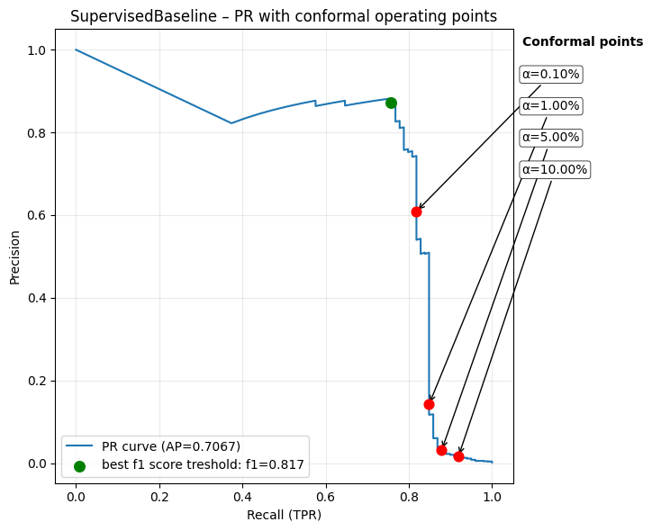

# FraudGuard — Deep Anomaly Detection with Conformal Prediction

This repository implements a two-stage credit card fraud detection system combining:

1. **Supervised classification** (upper-bound benchmark using labeled fraud)
2. **Unsupervised anomaly detection** via a Variational Autoencoder (VAE)
3. **Inductive Conformal Prediction (ICP)** for calibrated risk control and statistically guaranteed false positive bounds

The system is designed for extremely imbalanced settings (< 0.2% fraud) and emphasizes operational deployment concerns such as threshold selection, interpretability, and risk management.

---

## ✨ Key Contributions

- **Supervised Baseline (FCN)**  
  Establishes upper-bound performance using weighted binary classification.

- **Unsupervised VAE**  
  Learns a representation of “normal” behaviour without fraud labels.

- **Conformal Calibration (ICP)**  
  Converts raw anomaly scores into risk-controlled decisions with guaranteed False Positive Rate (FPR):

  > “We can afford to audit α% of legitimate transactions” → ICP computes the corresponding operational threshold.

- **Strong empirical performance**
  - ROC-AUC (supervised): 0.9758
  - ROC-AUC (VAE): 0.9343
  - Statistically valid calibration on test set (α → empirical FPR closely matched)

### 📊 Empirical Results (ROC & PR Curves)

<b>Supervised Baseline</b> 

 

<b>VAE (Unsupervised)</b> 

---

## 🏗 Repository Structure

The repository consists of two main components:

- **Core package (`fraudguard/`)**  
  Contains reusable modules for datasets, metrics, conformal calibration, and visualization.

- **Notebooks (`notebooks/`)**  
  Self-contained experiments demonstrating:
  - supervised baseline training + evaluation
  - VAE-based anomaly detection
  - conformal calibration and analysis
  
- **FraudGuard report**
  Outlines the theoretical basis and presents a comprehensive overview of the results.
    

All evaluation plots (ROC/PR/confusion matrices) are automatically saved under:
- notebooks/output_baseline_conformal/
- notebooks/outputs_vae_conformal/
