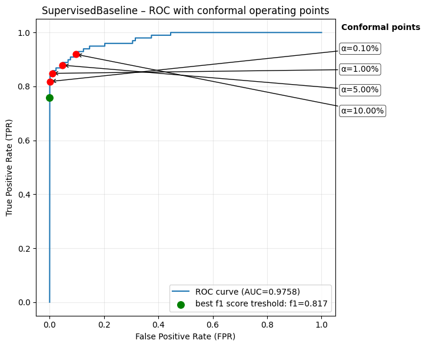
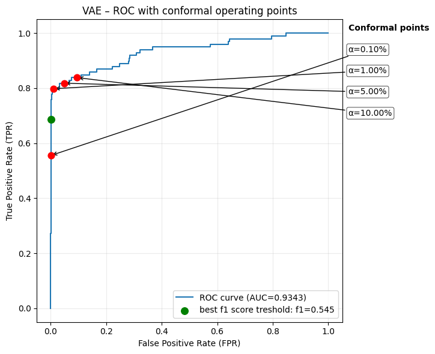
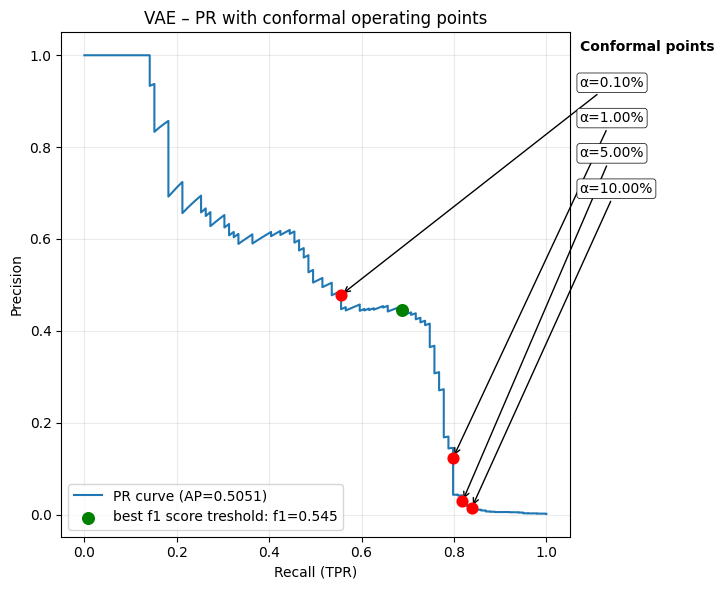

## FraudGuard — Deep Anomaly Detection with Conformal Prediction

## Description
FraudGuard is a learning project focused on fraud detection in highly imbalanced credit card transaction data. The repository provides reusable Python modules for data splitting, conformal calibration, evaluation metrics, and visualization. The objective is to evaluate different detection paradigms and apply conformal prediction to obtain statistically controlled decision thresholds.

1. **Supervised classification** — MLP neural network trained on labeled fraud to provide an approximate upper-bound baseline
2. **Unsupervised anomaly detection** — Variational Autoencoder (VAE) for detecting rare/abnormal transaction patterns
3. **Inductive Conformal Prediction (ICP)** — distribution-free uncertainty quantification with guaranteed control over false positive rates

The system is designed for extreme imbalance (<0.2% fraud) and prioritizes operational aspects such as threshold selection, interpretability, and risk-aware deployment.

## Results
- Supervised baseline ROC-AUC: `0.9758`.
- VAE ROC-AUC: `0.9343`.
- Statistically valid calibration on test set (α → empirical FPR closely matched).
### Empirical Results (ROC & PR Curves)
<div align="center">

<b>Supervised Baseline</b><br>



<br>

<b>VAE (Unsupervised)</b><br>



</div>

**Operational Choice**.
Comparing the two models, the α = 0.1% operating point emerges
as a strong candidate for deployment. It resides close to the optimal F1 region for the
Supervised model and captures the efficient frontier of the VAE. This threshold offers a
"good enough" balance—it is sufficiently close to the best statistical performance (F1)
while providing the business with a hard guarantee on the maximum number of daily false
alarms (operational cost).

## Installation
```bash
poetry install
poetry shell
```

## Usage
Run the study workflows:
```bash
jupyter notebook notebooks/SupervisedBaseline.ipynb
jupyter notebook notebooks/VAE.ipynb
```

## Project Structure
- `src/`        Importable package code (`fraudguard` modules)
- `data/raw/`   Dataset used by experiments
- `notebooks/`  Supervised and VAE experiment notebooks
- `models/`     Saved model checkpoints
- `docs/`       Report and generated evaluation figures

## Technical Highlights
- Shared data preparation logic supports both supervised and unsupervised workflows from one split interface.
- Conformal thresholds are derived from calibration scores to map risk tolerance to decision cutoffs.
- Plotting utilities place conformal operating points directly on ROC/PR curves for visual comparison.
- Training and evaluation are separated into reusable package functions and notebook-level orchestration.

## Report
Full project report covering the theoretical foundations, methodology, and results: 

[`docs/FraudGuard_report.pdf`](docs/FraudGuard_report.pdf)
